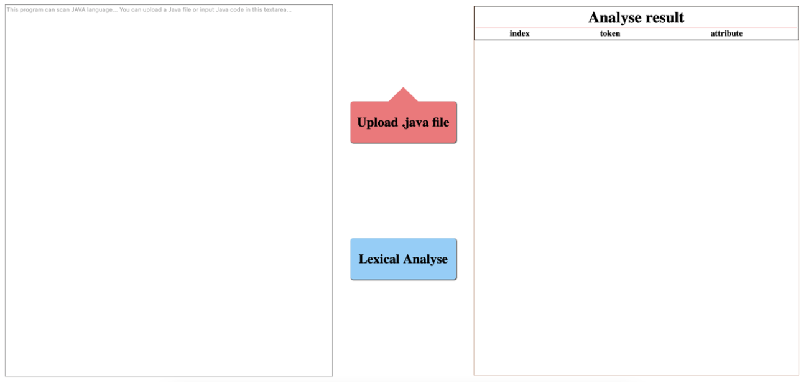
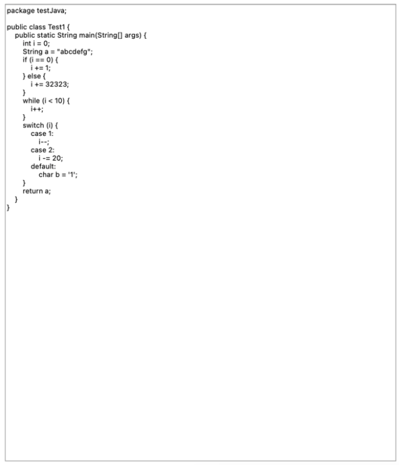
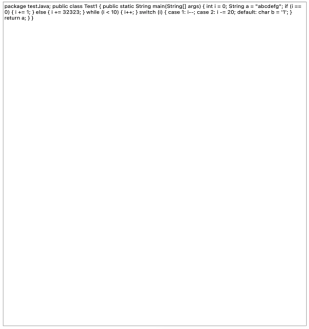
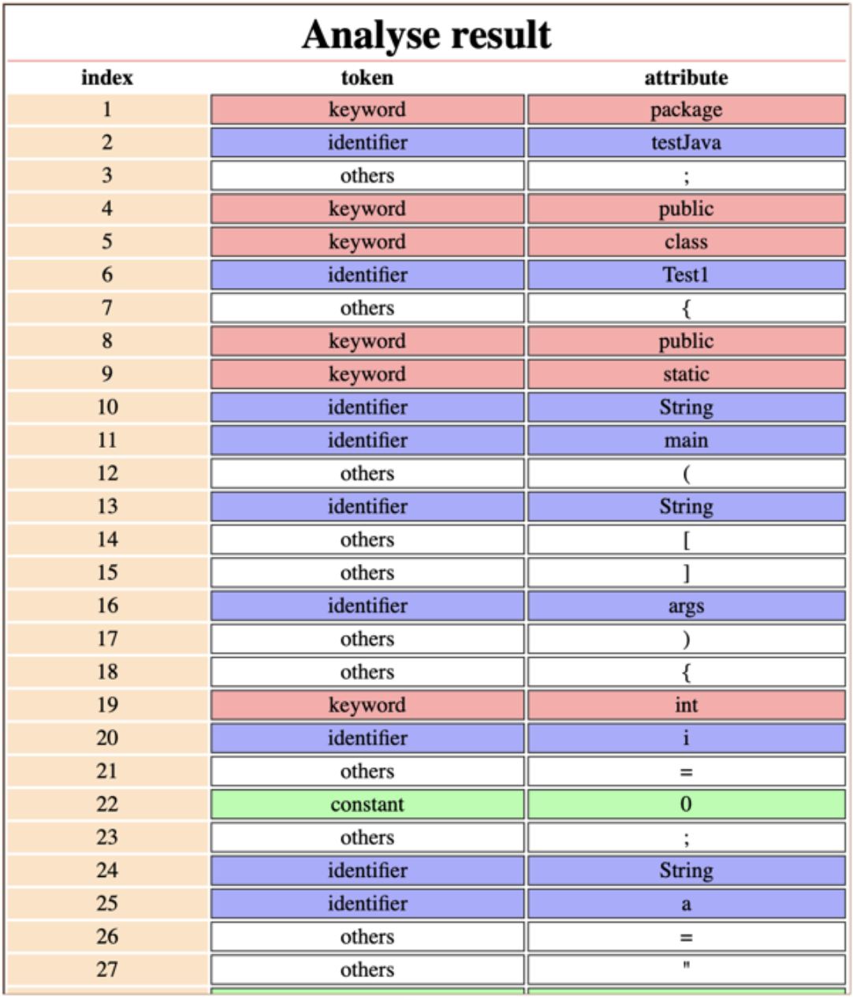

# Interface

# How to use
1. User can input Java codes in the left input text area or upload a Java file by clicking upload button.

2. User can click Lexical Analyse button to show the analysed result in the right table.

